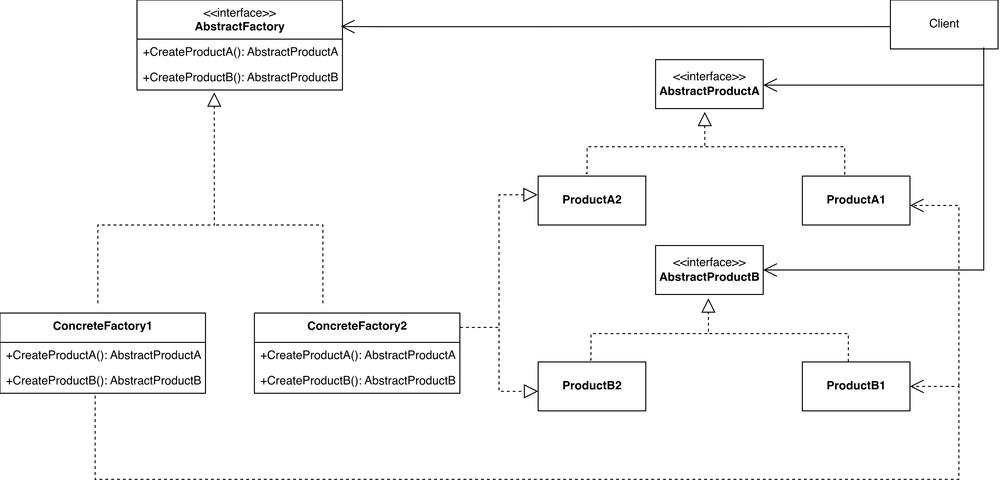

Abstract Factory Design Pattern
===============================

Introduction
------------

Abstract Factory pattern provide an interface for creating families of related or dependent objects without specifying their concrete classes.

Abstract Factory pattern is also known as Kit.

UML Class Diagram
-----------------

Participant
-----------

- AbstractFactory
- ConcreteFactory
- AbstractProduct
- ConcreteProduct
- Client

Usage
-----

Use the Abstract Factory pattern when:

- a system should be independent of how its products are created, composed, and represented.
- a system should be configured with one of multiple families of products.
- a family of related product objects is designed to be used together, and you need to enforce this constraint.
- you want to provide a class library of products, and you want to reveal just their interfaces, not their implementations.

Consequence
-----------

- It isolates concrete classes.
- It makes exchanging product families easy.
- It promotes consistency among products.
- Supporting new kinds of products is difficult.

Implementation
--------------

- Factories as singletons
- Creating the products.
- Defining extensible factories.

Sample Code
-----------

.. code-block:: cpp

    // AbstractFactory
    class MazeFactory {
    public:
        MazeFactory();
        virtual Maze* MakeMaze() const // => Maze =? AbstractProduct
            { return new Maze; }
        virtual Wall* MakeWall() const // Wall => AbstractProduct
            { return new Wall; }
        virtual Room* MakeRoom(int n) const // Room => AbstractProduct
            { return new Room(n); }
        virtual Door* MakeDoor(Room* r1, Room* r2) const // Door => AbstractProduct
            { return new Door(r1, r2); }
    };

    // Client
    Maze* MazeGame::CreateMaze (MazeFactory& factory) {
        Maze* aMaze = factory.MakeMaze();
        Room* r1 = factory.MakeRoom(1);
        Room* r2 = factory.MakeRoom(2);
        Door* aDoor = factory.MakeDoor(r1, r2);
        aMaze->AddRoom(r1);
        aMaze->AddRoom(r2);
        r1->SetSide(North, factory.MakeWall());
        r1->SetSide(East, aDoor);
        r1->SetSide(South, factory.MakeWall());
        r1->SetSide(West, factory.MakeWall());
        r2->SetSide(North, factory.MakeWall());
        r2->SetSide(East, factory.MakeWall());
        r2->SetSide(South, factory.MakeWall());
        r2->SetSide(West, aDoor);
        return aMaze;
    }

    // ConcreteFactory
    class EnchantedMazeFactory : public MazeFactory {
    public:
        EnchantedMazeFactory();
        virtual Room* MakeRoom(int n) const
            { return new EnchantedRoom(n, CastSpell()); }
        virtual Door* MakeDoor(Room* r1, Room* r2) const
            { return new DoorNeedingSpell(r1, r2); }
    protected:
        Spell* CastSpell() const;
    };

    // ConcreteFactory
    Wall* BombedMazeFactory::MakeWall () const {
        return new BombedWall;
    }
    Room* BombedMazeFactory::MakeRoom(int n) const {
        return new RoomWithABomb(n);
    }   

    MazeGame game;
    BombedMazeFactory factory;

    game.CreateMaze(factory);

Example
-------

1. Cross-Platform GUI Components
~~~~~~~~~~~~~~~~~~~~~~~~~~~~~~~~

You are building a Java desktop application that must look native on both Windows and macOS. Buttons and checkboxes should render differently on each OS, but your business logic (the client code) should never know or care about the concrete classes — it should only work with abstract interfaces.

.. code-block:: java

    // Abstract Products
    interface Button {
        void paint();
    }

    interface Checkbox {
        void toggle();
    }

    // Concrete Products - Windows
    class WindowsButton implements Button {
        public void paint() {
            System.out.println("🟦 Windows Button painted");
        }
    }

    class WindowsCheckbox implements Checkbox {
        public void toggle() {
            System.out.println("☑️ Windows Checkbox toggled");
        }
    }

    // Concrete Products - macOS
    class MacButton implements Button {
        public void paint() {
            System.out.println("🍎 Mac Button painted");
        }
    }

    class MacCheckbox implements Checkbox {
        public void toggle() {
            System.out.println("✅ Mac Checkbox toggled");
        }
    }

    // Abstract Factory
    interface GUIFactory {
        Button createButton();
        Checkbox createCheckbox();
    }

    // Concrete Factories
    class WindowsFactory implements GUIFactory {
        public Button createButton() { return new WindowsButton(); }
        public Checkbox createCheckbox() { return new WindowsCheckbox(); }
    }

    class MacFactory implements GUIFactory {
        public Button createButton() { return new MacButton(); }
        public Checkbox createCheckbox() { return new MacCheckbox(); }
    }

    // Client
    class Application {
        private Button button;
        private Checkbox checkbox;

        public Application(GUIFactory factory) {
            button = factory.createButton();
            checkbox = factory.createCheckbox();
        }

        public void paint() {
            button.paint();
            checkbox.toggle();
        }
    }

    // Usage
    public class Main {
        public static void main(String[] args) {
            String os = System.getProperty("os.name").toLowerCase();
            GUIFactory factory = os.contains("win") ? new WindowsFactory() : new MacFactory();

            Application app = new Application(factory);
            app.paint();
        }
    }

2. Furniture Sets for Different Styles
~~~~~~~~~~~~~~~~~~~~~~~~~~~~~~~~~~~~~~

A furniture company sells complete room sets (Chair + Sofa) in two styles: Modern and Victorian. You must guarantee that a customer who chooses Modern gets a Modern chair AND a Modern sofa — never a mix. The sales system should work with any style without changing client code.

.. code-block:: java

    // Abstract Products
    interface Chair {
        void sitOn();
    }

    interface Sofa {
        void lieOn();
    }

    // Concrete Products - Modern
    class ModernChair implements Chair {
        public void sitOn() {
            System.out.println("🪑 Sitting on a sleek Modern chair");
        }
    }

    class ModernSofa implements Sofa {
        public void lieOn() {
            System.out.println("🛋️ Relaxing on a Modern sofa");
        }
    }

    // Concrete Products - Victorian
    class VictorianChair implements Chair {
        public void sitOn() {
            System.out.println("🪑 Sitting on an elegant Victorian chair");
        }
    }

    class VictorianSofa implements Sofa {
        public void lieOn() {
            System.out.println("🛋️ Lounging on a Victorian sofa");
        }
    }

    // Abstract Factory
    interface FurnitureFactory {
        Chair createChair();
        Sofa createSofa();
    }

    // Concrete Factories
    class ModernFurnitureFactory implements FurnitureFactory {
        public Chair createChair() { return new ModernChair(); }
        public Sofa createSofa() { return new ModernSofa(); }
    }

    class VictorianFurnitureFactory implements FurnitureFactory {
        public Chair createChair() { return new VictorianChair(); }
        public Sofa createSofa() { return new VictorianSofa(); }
    }

    // Client
    class Room {
        private Chair chair;
        private Sofa sofa;

        public Room(FurnitureFactory factory) {
            chair = factory.createChair();
            sofa = factory.createSofa();
        }

        public void furnish() {
            chair.sitOn();
            sofa.lieOn();
        }
    }

    // Usage
    public class Main {
        public static void main(String[] args) {
            FurnitureFactory factory = new ModernFurnitureFactory(); // or VictorianFurnitureFactory
            Room room = new Room(factory);
            room.furnish();
        }
    }

3. Database DAOs for Different Vendors
~~~~~~~~~~~~~~~~~~~~~~~~~~~~~~~~~~~~~~

Your enterprise application must support both MySQL and PostgreSQL. You have UserDAO and OrderDAO. Switching databases should require changing only one line of code (the factory), never the service layer that uses the DAOs.

.. code-block:: java

    // Abstract Products (DAOs)
    interface UserDAO {
        void save(String user);
    }

    interface OrderDAO {
        void save(String order);
    }

    // Concrete Products - MySQL
    class MySQLUserDAO implements UserDAO {
        public void save(String user) {
            System.out.println("💾 Saved user to MySQL: " + user);
        }
    }

    class MySQLOrderDAO implements OrderDAO {
        public void save(String order) {
            System.out.println("💾 Saved order to MySQL: " + order);
        }
    }

    // Concrete Products - PostgreSQL
    class PostgresUserDAO implements UserDAO {
        public void save(String user) {
            System.out.println("🐘 Saved user to PostgreSQL: " + user);
        }
    }

    class PostgresOrderDAO implements OrderDAO {
        public void save(String order) {
            System.out.println("🐘 Saved order to PostgreSQL: " + order);
        }
    }

    // Abstract Factory
    interface DAOFactory {
        UserDAO createUserDAO();
        OrderDAO createOrderDAO();
    }

    // Concrete Factories
    class MySQLDAOFactory implements DAOFactory {
        public UserDAO createUserDAO() { return new MySQLUserDAO(); }
        public OrderDAO createOrderDAO() { return new MySQLOrderDAO(); }
    }

    class PostgresDAOFactory implements DAOFactory {
        public UserDAO createUserDAO() { return new PostgresUserDAO(); }
        public OrderDAO createOrderDAO() { return new PostgresOrderDAO(); }
    }

    // Client (Service layer)
    class UserService {
        private UserDAO userDAO;
        private OrderDAO orderDAO;

        public UserService(DAOFactory factory) {
            userDAO = factory.createUserDAO();
            orderDAO = factory.createOrderDAO();
        }

        public void registerUser(String name) {
            userDAO.save(name);
            orderDAO.save("Welcome order for " + name);
        }
    }

    // Usage
    public class Main {
        public static void main(String[] args) {
            DAOFactory factory = new PostgresDAOFactory(); // change to MySQLDAOFactory to switch DB
            UserService service = new UserService(factory);
            service.registerUser("Alice");
        }
    }