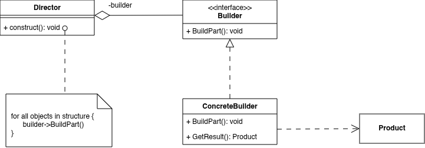
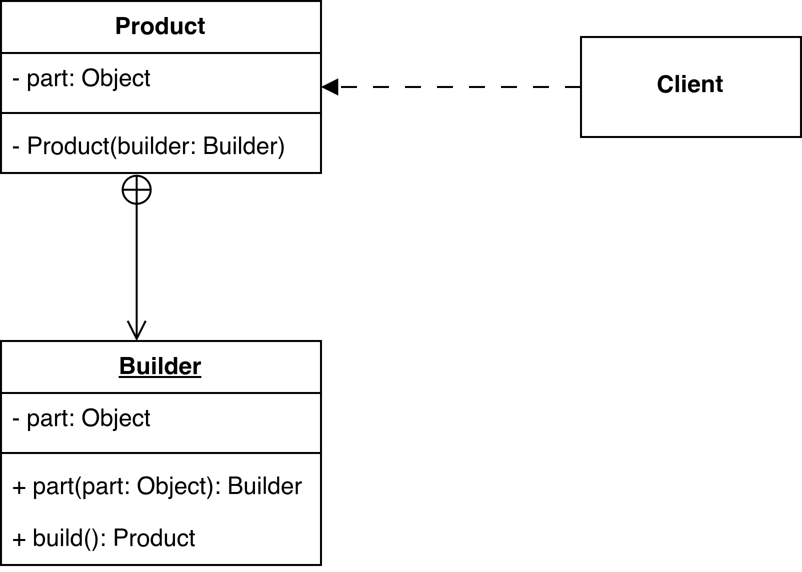

Builder Design Pattern
======================

Introduction
------------

Builder Pattern separate the construction of a complex object from its representation so that the same construction process can create different representations.

UML Class Diagram
-----------------

Participant
-----------

- Builder
- ConcreteBuilder
- Director
- Product

Usage
-----

Use the Builder pattern when:

- the algorithm for creating a complex object should be independent of the parts that make up the object and how they're assembled.
- the construction process must allow different representations for the object that's constructed.

Consequence
-----------

- It lets you vary a product's internal representation.
- It isolates code for construction and representation.
- It gives you finer control over the construction process

Implementation
--------------

- An abstract Builder class
- Assembly and construction interface
- Why no abstract class for products?
- Empty methods as default in Builder

Sample Code
-----------

.. code-block:: cpp

    class MazeBuilder {
    public:
        virtual void BuildMaze() { }
        virtual void BuildRoom(int room) { }
        virtual void BuildDoor(int roomFrom, int roomTo) { }
        virtual Maze* GetMaze() { return 0; }
    protected:
        MazeBuilder();
    };

    Maze* MazeGame::CreateMaze (MazeBuilder& builder) {
        builder.BuildMaze();
        builder.BuildRoom(1);
        builder.BuildRoom(2);
        builder.BuildDoor(1, 2);
        return builder.GetMaze();
    }

    Maze* MazeGame::CreateComplexMaze (MazeBuilder& builder) {
        builder.BuildRoom(1);
        // ...
        builder.BuildRoom(1001);
        return builder.GetMaze();
    }

    class StandardMazeBuilder : public MazeBuilder {
    public:
        StandardMazeBuilder();
        virtual void BuildMaze();
        virtual void BuildRoom(int);
        virtual void BuildDoor(int, int);
        virtual Maze* GetMaze();
    private:
        Direction CommonWall(Room*, Room*);
        Maze* _currentMaze;
    };

    StandardMazeBuilder::StandardMazeBuilder () {
        _currentMaze = 0;
    }

    void StandardMazeBuilder::BuildMaze () {
        _currentMaze = new Maze;
    }
    Maze* StandardMazeBuilder::GetMaze () {
        return _currentMaze;
    }

    void StandardMazeBuilder::BuildRoom (int n) {
        if (!_currentMaze->RoomNo(n)) {
            Room* room = new Room(n);
            _currentMaze->AddRoom(room);
            room->SetSide(North, new Wall);
            room->SetSide(South, new Wall);
            room->SetSide(East, new Wall);
            room->SetSide(West, new Wall);
        }
    }
        
    void StandardMazeBuilder:rBuildDoor (int nl, int n2) {
        Room* rl = _currentMaze->RoomNo(nl);
        Room* r2 = _currentMaze->RoomNo(n2);
        Door* d = new Door(rl, r2);
        rl->SetSide(CommonWall(rl,r2), d);
        r2->SetSide(CommonWall(r2,rl), d);
    }

    Maze* maze;
    MazeGame game;
    StandardMazeBuilder builder;
    game.CreateMaze(builder);
    maze = builder.GetMaze();

    class CountingMazeBuilder : public MazeBuilder {
    public:
        CountingMazeBuilder();
        virtual void BuildMaze();
        virtual void BuildRoom(int);
        virtual void BuildDoor(int, int);
        virtual void AddWall(int, Direction);
        void GetCounts(int&, int&) const;
    private:
        int _doors;
        int _rooms;
    };

    CountingMazeBuilder::CountingMazeBuilder () {
        _rooms = _doors = 0;
    }
    void CountingMazeBuilder::BuildRoom (int) {
        _rooms++;
    }
    void CountingMazeBuilder::BuildDoor (int, int) {
        _doors++;
    }
    void CountingMazeBuilder::GetCounts (
        int& rooms, int& doors
    ) const {
        rooms = _rooms;
        doors = _doors;
    }

    int rooms, doors;
    MazeGame game;
    CountingMazeBuilder builder;

    game.CreateMaze(builder);
    builder.GetCounts(rooms, doors);

    cout << "The maze has "
         << rooms << " rooms and "
         << doors << " doors" << endl;

Example
-------

1. Building a House
~~~~~~~~~~~~~~~~~~~

Constructing a house involves multiple steps such as building walls, roof, doors, and windows. Different types of houses (Wooden, Concrete) require different implementations, but the construction process is similar. We want to separate how the house is built from what type of house is built.

.. code-block:: java

    // Product
    class House {
        private String foundation;
        private String walls;
        private String roof;

        public void setFoundation(String foundation) { this.foundation = foundation; }
        public void setWalls(String walls) { this.walls = walls; }
        public void setRoof(String roof) { this.roof = roof; }

        @Override
        public String toString() {
            return "House with " + foundation + ", " + walls + ", " + roof;
        }
    }

    // Builder
    interface HouseBuilder {
        void buildFoundation();
        void buildWalls();
        void buildRoof();
        House getHouse();
    }

    // ConcreteBuilder
    class WoodenHouseBuilder implements HouseBuilder {
        private House house = new House();

        public void buildFoundation() {
            house.setFoundation("Wooden Foundation");
        }

        public void buildWalls() {
            house.setWalls("Wooden Walls");
        }

        public void buildRoof() {
            house.setRoof("Wooden Roof");
        }

        public House getHouse() {
            return house;
        }
    }

    // Director
    class ConstructionEngineer {
        private HouseBuilder builder;

        public ConstructionEngineer(HouseBuilder builder) {
            this.builder = builder;
        }

        public House constructHouse() {
            builder.buildFoundation();
            builder.buildWalls();
            builder.buildRoof();
            return builder.getHouse();
        }
    }

    // Usage
    public class Main {
        public static void main(String[] args) {
            HouseBuilder builder = new WoodenHouseBuilder();
            ConstructionEngineer engineer = new ConstructionEngineer(builder);

            House house = engineer.constructHouse();
            System.out.println(house);
        }
    }

2. Building a Computer
~~~~~~~~~~~~~~~~~~~~~~

When assembling a computer, we must install CPU, RAM, Storage, and GPU. Different computer types (Gaming PC, Office PC) require different configurations. We want to construct computers step-by-step without exposing the internal assembly process.

.. code-block:: java

    // Product
    class Computer {
        private String cpu;
        private String ram;
        private String storage;
        private String gpu;

        public void setCpu(String cpu) { this.cpu = cpu; }
        public void setRam(String ram) { this.ram = ram; }
        public void setStorage(String storage) { this.storage = storage; }
        public void setGpu(String gpu) { this.gpu = gpu; }

        @Override
        public String toString() {
            return "CPU: " + cpu + ", RAM: " + ram +
                ", Storage: " + storage + ", GPU: " + gpu;
        }
    }

    // Builder
    interface ComputerBuilder {
        void buildCpu();
        void buildRam();
        void buildStorage();
        void buildGpu();
        Computer getComputer();
    }

    // ConcreteBuilder
    class GamingComputerBuilder implements ComputerBuilder {
        private Computer computer = new Computer();

        public void buildCpu() {
            computer.setCpu("Intel i9");
        }

        public void buildRam() {
            computer.setRam("32GB RAM");
        }

        public void buildStorage() {
            computer.setStorage("1TB SSD");
        }

        public void buildGpu() {
            computer.setGpu("RTX 4090");
        }

        public Computer getComputer() {
            return computer;
        }
    }

    // Director
    class ComputerDirector {
        private ComputerBuilder builder;

        public ComputerDirector(ComputerBuilder builder) {
            this.builder = builder;
        }

        public Computer buildComputer() {
            builder.buildCpu();
            builder.buildRam();
            builder.buildStorage();
            builder.buildGpu();
            return builder.getComputer();
        }
    }

    // Usage
    public class Main {
        public static void main(String[] args) {
            ComputerBuilder builder = new GamingComputerBuilder();
            ComputerDirector director = new ComputerDirector(builder);

            Computer computer = director.buildComputer();
            System.out.println(computer);
        }
    }

3. Email Builder [Fluent Builder Pattern]
~~~~~~~~~~~~~~~~~~~~~~~~~~~~~~~~~~~~~~~~~

A SaaS platform sends different kinds of emails (welcome, invoice, marketing). Every email needs From, To, and Subject, but CC, BCC, body type, and attachments are optional. The Builder pattern makes creating these emails clean, safe, and readable.

.. code-block:: java

    import java.util.ArrayList;
    import java.util.List;

    class Email {
        private final String from;
        private final String to;
        private final String subject;
        private final String body;
        private final List<String> cc;
        private final List<String> attachments;

        private Email(Builder builder) {
            this.from = builder.from;
            this.to = builder.to;
            this.subject = builder.subject;
            this.body = builder.body;
            this.cc = builder.cc;
            this.attachments = builder.attachments;
        }

        @Override
        public String toString() {
            return "✉️ Email [From: " + from + ", To: " + to + ", Subject: " + subject + 
                ", CC: " + cc + ", Attachments: " + attachments + "]";
        }

        static class Builder {
            private String from;
            private String to;
            private String subject;
            private String body = "";
            private List<String> cc = new ArrayList<>();
            private List<String> attachments = new ArrayList<>();

            public Builder from(String from) {
                this.from = from;
                return this;
            }

            public Builder to(String to) {
                this.to = to;
                return this;
            }

            public Builder subject(String subject) {
                this.subject = subject;
                return this;
            }

            public Builder body(String body) {
                this.body = body;
                return this;
            }

            public Builder addCc(String email) {
                this.cc.add(email);
                return this;
            }

            public Builder addAttachment(String file) {
                this.attachments.add(file);
                return this;
            }

            public Email build() {
                if (from == null || to == null || subject == null) {
                    throw new IllegalStateException("From, To and Subject are required for email");
                }
                return new Email(this);
            }
        }
    }

    public class Main {
        public static void main(String[] args) {
            Email welcome = new Email.Builder()
                    .from("noreply@startup.com")
                    .to("newuser@gmail.com")
                    .subject("Welcome to Our Platform!")
                    .body("Thank you for joining us 🎉")
                    .addCc("founder@startup.com")
                    .addAttachment("welcome-guide.pdf")
                    .build();

            Email invoice = new Email.Builder()
                    .from("billing@company.com")
                    .to("client@business.com")
                    .subject("Your Invoice for February")
                    .body("Please find attached invoice.")
                    .addAttachment("invoice-2025-02.pdf")
                    .build();

            System.out.println(welcome);
            System.out.println(invoice);
        }
    }
