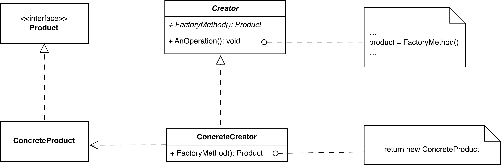
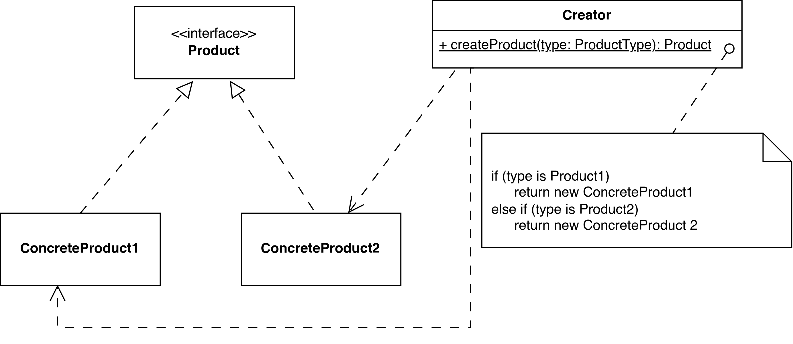

Factory Method Design Pattern
=============================

Introduction
------------

Define an interface for creating an object, but let subclasses decide which class to instantiate. Factory Method lets a class defer instantiation to subclasses.

Factory Method pattern is also known as Virtual Constructor.

UML Class Diagram
-----------------

Participant
-----------

- Product
- ConcreteProduct
- Creator
- ConcreteCreator

Usage
-----

Use the Factory Method pattern when:

- a class can't anticipate the class of objects it must create.
- a class wants its subclasses to specify the objects it creates.
- classes delegate responsibility to one of several helper subclasses, and you want to localize the knowledge of which helper subclass is the delegate.

Consequence
-----------

- Eliminate the need to bind application-specific classes
- Might have to subclass the Creator class
- Provides hooks for subclasses
- Connects parallel class hierarchies

Implementation
--------------

- Two major varieties
- Parameterized factory methods
- Language-specific variants and issues
- Using templates to avoid subclassing
- Naming conventions

Sample Code
-----------

.. code-block:: cpp

    class MazeGame {
    public:
        Maze* CreateMaze();

    // factory methods:

        virtual Maze* MakeMaze() const
            { return new Maze; }
        virtual Room* MakeRoom(int n) const
            { return new Room(n); }
        virtual Wall* MakeWall() const
            { return new Wall; }
        virtual Door* MakeDoor(Room* r1, Room* r2) const
            { return new Door(r1, r2); }
    };

    Maze* MazeGame::CreateMaze () {
        Maze* aMaze = MakeMaze();

        Room* r1 = MakeRoom(1);
        Room* r2 = MakeRoom(2);
        Door* theDoor = MakeDoor(r1, r2);

        aMaze->AddRoom(r1);
        aMaze->AddRoom(r2);

        r1->SetSide(North, MakeWall());
        r1->SetSide(East, theDoor);
        r1->SetSide(South, MakeWall());
        r1->SetSide(West, MakeWall());
        r2->SetSide(East, MakeWall());
        r2->SetSide(South, MakeWall());
        r2->SetSide(South, MakeWall());
        r2->SetSide(South, MakeWall());
        r2->SetSide(South, MakeWall());
        r2->SetSide(South, MakeWall());
        r2->SetSide(West, theDoor);

        return aMaze;
    }

    class BombedMazeGame : public MazeGame {
    public:
        BombedMazeGame();
        virtual Wall* MakeWall() const
            { return new BombedWall; }
        virtual Room* MakeRoom(int n) const
            { return new RoomWithABomb(n); }
    };

    class EnchantedMazeGame : public MazeGame {
    public:
        EnchantedMazeGame();
        virtual Room* MakeRoom(int n) const
            { return new EnchantedRoom(n, CastSpell()); }
        virtual Door* MakeDoor(Room* rl, Room* r2) const
            { return new DoorNeedingSpell(rl, r2); }
    protected:
        Spell* CastSpell() const;
    };

Example
-------

1. Payment Method Processor
~~~~~~~~~~~~~~~~~~~~~~~~~~~

An online shopping platform needs to handle different payment methods like Credit Card or PayPal. The Factory Method pattern allows a base PaymentProcessor class to define a factory method for creating the specific payment handler, while subclasses decide which concrete payment class to instantiate. This way, adding new payment methods doesn't change the client code.

.. code-block:: java

    // Abstract Product
    interface Payment {
        void process(double amount);
    }

    // Concrete Products
    class CreditCardPayment implements Payment {
        public void process(double amount) {
            System.out.println("💳 Processing credit card payment of $" + amount);
        }
    }

    class PayPalPayment implements Payment {
        public void process(double amount) {
            System.out.println("📱 Processing PayPal payment of $" + amount);
        }
    }

    // Abstract Creator
    abstract class PaymentProcessor {
        // Factory Method
        protected abstract Payment createPayment();

        public void executePayment(double amount) {
            Payment payment = createPayment();
            payment.process(amount);
        }
    }

    // Concrete Creators
    class CreditCardProcessor extends PaymentProcessor {
        @Override
        protected Payment createPayment() {
            return new CreditCardPayment();
        }
    }

    class PayPalProcessor extends PaymentProcessor {
        @Override
        protected Payment createPayment() {
            return new PayPalPayment();
        }
    }

    // Client
    public class Main {
        public static void main(String[] args) {
            PaymentProcessor processor = new CreditCardProcessor(); // or PayPalProcessor
            processor.executePayment(99.99);
        }
    }

2. Logger Creation
~~~~~~~~~~~~~~~~~~

A web application requires logging to different destinations like console or file for debugging and auditing. The Factory Method pattern uses a base LoggerFactory with a method to create loggers, and subclasses implement it to return specific logger types, making it easy to switch logging strategies without altering the main application code.

.. code-block:: java

    // Abstract Product
    interface Logger {
        void log(String message);
    }

    // Concrete Products
    class ConsoleLogger implements Logger {
        public void log(String message) {
            System.out.println("🖥️ Console log: " + message);
        }
    }

    class FileLogger implements Logger {
        public void log(String message) {
            System.out.println("📁 File log: " + message); // Simulate file write
        }
    }

    // Abstract Creator
    abstract class LoggerFactory {
        // Factory Method
        protected abstract Logger createLogger();

        public void writeLog(String message) {
            Logger logger = createLogger();
            logger.log(message);
        }
    }

    // Concrete Creators
    class ConsoleLoggerFactory extends LoggerFactory {
        @Override
        protected Logger createLogger() {
            return new ConsoleLogger();
        }
    }

    class FileLoggerFactory extends LoggerFactory {
        @Override
        protected Logger createLogger() {
            return new FileLogger();
        }
    }

    // Client
    public class Main {
        public static void main(String[] args) {
            LoggerFactory factory = new FileLoggerFactory(); // or ConsoleLoggerFactory
            factory.writeLog("Application started successfully.");
        }
    }

3. Vehicle Factory [Simple Factory Pattern]
~~~~~~~~~~~~~~~~~~~~~~~~~~~~~~~~~~~~~~~~~~~

A car rental app needs to create different types of vehicles (e.g., Car or Bike) based on user input. The Simple Factory pattern uses a single factory class with a static method to return the appropriate vehicle object, encapsulating the creation logic and making it easy to add new vehicle types without changing client code.

.. code-block:: java

    // Product Interface
    interface Vehicle {
        void drive();
    }

    // Concrete Products
    class Car implements Vehicle {
        public void drive() {
            System.out.println("🚗 Driving a car");
        }
    }

    class Bike implements Vehicle {
        public void drive() {
            System.out.println("🏍️ Riding a bike");
        }
    }

    // Simple Factory
    class VehicleFactory {
        public static Vehicle createVehicle(String type) {
            if ("car".equalsIgnoreCase(type)) {
                return new Car();
            } else if ("bike".equalsIgnoreCase(type)) {
                return new Bike();
            } else {
                throw new IllegalArgumentException("Unknown vehicle type: " + type);
            }
        }
    }

    // Client
    public class Main {
        public static void main(String[] args) {
            Vehicle vehicle1 = VehicleFactory.createVehicle("car");
            vehicle1.drive();

            Vehicle vehicle2 = VehicleFactory.createVehicle("bike");
            vehicle2.drive();
        }
    }