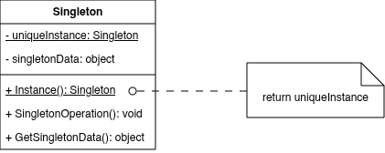

Singleton Design Pattern
========================

Introduction
------------

Ensure a class only has one instance, and provide a global point of access to it.

UML Class Diagram
-----------------

Participant
-----------

- Singleton

Usage
-----

Use the Singleton pattern when:

- there must be exactly one instance of a class, and it must be accessible to clients from a well-known access point.
- when the sole instance should be extensible by subclassing, and clients should be able to use an extended instance without modifying their code.

Consequence
-----------

- Controlled access to sole instance
- Reduced name space
- Permits refinement of operations and representation
- Permits a variable number of instances
- More flexible than class operations

Implementation
--------------

- Ensuring a unique instance
- Subclassing the Singleton class

Sample Code
-----------

.. code-block:: cpp
    
    class MazeFactory {
    public:
        static MazeFactory* Instance();
        
        // existing interface goes here
    protected:
        MazeFactory();
    private:
        static MazeFactory* _instance;
    };

    MazeFactory* MazeFactory::_instance = 0;
    
    MazeFactory* MazeFactory::Instance () {
        if (_instance == 0) {
            _instance = new MazeFactory;
        }
        return _instance;
    }
    
    MazeFactory* MazeFactory::Instance () {
        if (_instance == 0) {
            const char* mazeStyle = getenv("MAZESTYLE");
            
            if (strcmp(mazeStyle, "bombed") == 0) {
                _instance = new BombedMazeFactory;
                
            } else if (strcmp(mazeStyle, "enchanted") == 0) {
                _instance = new EnchantedMazeFactory;
                
            // ... other possible subclasses
                
            } else {        // default
                _instance = new MazeFactory;
            }
        }
        return _instance;
    }
    
Example
-------

1. Printer Spooler
~~~~~~~~~~~~~~~~~~

A desktop printing application must manage all print jobs through a single queue to avoid conflicts, duplicate printing, or out-of-order jobs. Multiple spooler instances would break the printing workflow.

..  code-block:: java

    import java.util.LinkedList;
    import java.util.Queue;
    
    public class PrinterSpooler {
        private static volatile PrinterSpooler instance;
        private final Queue<String> printQueue = new LinkedList<>();
    
        // private => 100%
        // protected => 80%
        private PrinterSpooler() { 
            System.out.println("🖨️ PrinterSpooler initialized");
        }
    
        public static PrinterSpooler getInstance() {
            if (instance == null) {
                synchronized (PrinterSpooler.class) {
                    if (instance == null) {
                        instance = new PrinterSpooler();
                    }
                }
            }
            return instance;
        }
    
        public void addJob(String document) {
            printQueue.add(document);
            System.out.println("📄 Job added: " + document);
        }
    
        public void printNext() {
            if (!printQueue.isEmpty()) {
                String doc = printQueue.poll();
                System.out.println("🖨️ Printing: " + doc);
            } else {
                System.out.println("Queue is empty");
            }
        }
    }
    
    public class Main {
        public static void main(String[] args) {
            PrinterSpooler spooler1 = PrinterSpooler.getInstance();
            PrinterSpooler spooler2 = PrinterSpooler.getInstance();
    
            System.out.println("Same instance? " + (spooler1 == spooler2));
    
            spooler1.addJob("Report.pdf");
            spooler2.addJob("Invoice.docx");
            spooler1.printNext();
            spooler1.printNext();
        }
    }

2. Unique ID Generator
~~~~~~~~~~~~~~~~~~~~~~

A banking or order management system needs to generate unique sequential IDs (transaction IDs, order numbers) across all modules and threads. Only one generator instance guarantees no duplicate or skipped IDs.

.. code-block:: java

    import java.util.concurrent.atomic.AtomicLong;
    
    public class IdGenerator {
        private static final IdGenerator instance = new IdGenerator();
        private final AtomicLong counter = new AtomicLong(1000000);
    
        private IdGenerator() {
            System.out.println("🔢 ID Generator initialized");
        }
    
        public static IdGenerator getInstance() {
            return instance; // Eager initialization (thread-safe)
        }
    
        public long nextId() {
            return counter.getAndIncrement();
        }
    }
    
    public class Main {
        public static void main(String[] args) {
            IdGenerator gen1 = IdGenerator.getInstance();
            IdGenerator gen2 = IdGenerator.getInstance();
    
            System.out.println("Same instance? " + (gen1 == gen2));
    
            System.out.println("Order ID: " + gen1.nextId());
            System.out.println("Order ID: " + gen2.nextId());
            System.out.println("Transaction ID: " + gen1.nextId());
        }
    }
    
3. Theme Manager
~~~~~~~~~~~~~~~~

A Java Swing or JavaFX application must apply the same visual theme (light/dark mode, colors) to every screen and component. A single ThemeManager ensures consistent UI appearance without passing theme objects everywhere.

.. code-block:: java

    public class ThemeManager {
        private static ThemeManager instance;
        private String themeName = "Light";
        private String primaryColor = "#FFFFFF";
        private String accentColor = "#007BFF";
    
        private ThemeManager() {
            System.out.println("🎨 ThemeManager initialized");
        }
    
        public static synchronized ThemeManager getInstance() {
            if (instance == null) {
                instance = new ThemeManager();
            }
            return instance;
        }
    
        public String getThemeName() {
            return themeName;
        }
    
        public void setTheme(String newTheme) {
            this.themeName = newTheme;
            if ("Dark".equalsIgnoreCase(newTheme)) {
                primaryColor = "#1F1F1F";
                accentColor = "#0A84FF";
            } else {
                primaryColor = "#FFFFFF";
                accentColor = "#007BFF";
            }
            System.out.println("Theme switched to: " + newTheme);
        }
    
        public String getPrimaryColor() { return primaryColor; }
        public String getAccentColor() { return accentColor; }
    }
    
    public class Main {
        public static void main(String[] args) {
            ThemeManager tm1 = ThemeManager.getInstance();
            ThemeManager tm2 = ThemeManager.getInstance();
    
            tm1.setTheme("Dark");
    
            System.out.println("Same instance? " + (tm1 == tm2));
            System.out.println("Primary color (from tm2): " + tm2.getPrimaryColor());
            System.out.println("Accent color: " + tm2.getAccentColor());
        }
    }