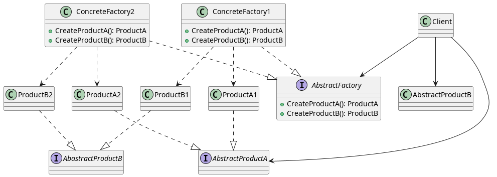

# Abstract Factory
## Intent
provide an interface for creating families of related or dependent objects without specifying their concrete classes.
## Also Known As
Kit
## Motivation

## Applicability

## Structure 

## Participants
- AbstractFactory
- ConcreteFactory
- AbstractProduct
- ConcretProduct
- Client 
## Collaborations
## Consequences
## Implementations
## Sample Code
## Known Use
## Related Pattern